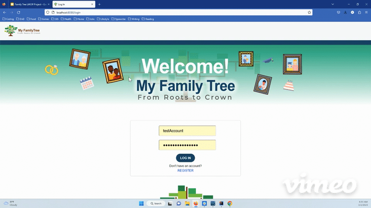
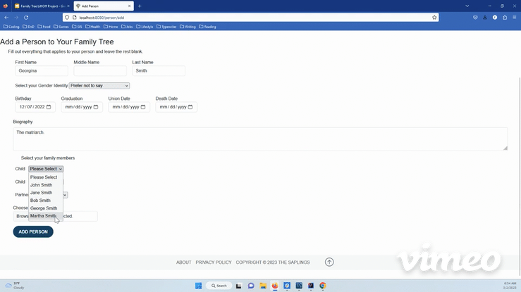
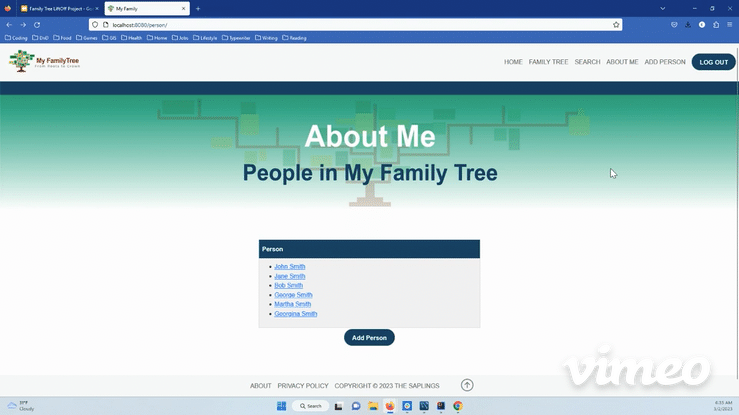

# Family Tree LiftOff Project

### Overview
Understanding family heritage is important, but often family history is saved between different family members, various documents, or family artifacts. These separate sources are rarely archived or saved in a way that lives on past members of the family.

We seek to help users document their family trees and store cherished memories of loved ones. Users are able to add family members, details about those family members (including a biography, important dates, and photos), and see how their familly is connected through a family tree interface. The app will soon have a forum to comment on aspects of the family tree.

### Completed Features Demonstration
- **Login**: The site features an authentication controller for locking access to personal data behind a salted and hashed password.

- **Adding A Person**: Adding a person will insert them into your "About Me" page, which lists all family members.

- **Tree View**: Persons added to your family tree can be displayed in a graph showing relationships.

- **Modals**: We've got pop-up windows to satisfy your curiosity about the team and legal indemnification.

### Technologies
- Java
- JavaScript
- Spring Boot
- MySQL
- Hibernate
- Thymeleaf
- D3

### Planned Features
- **Role Access Management**: Each user of the site will be given a level of access, which will allow them to modify the family tree to different levels.
- **Website Forum**: Users will have a place to discuss recent edits to the family tree.
